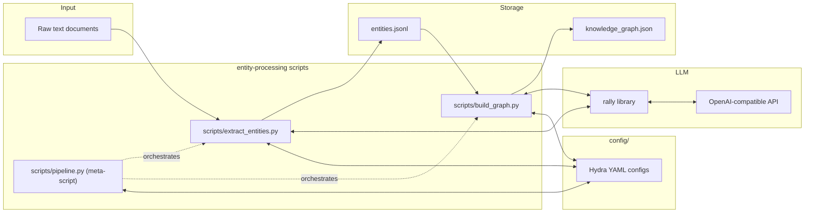
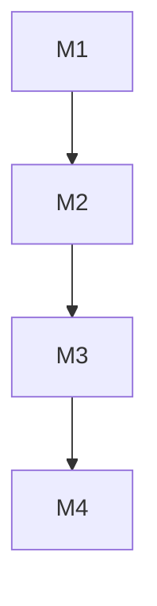

## entity-processing constitution spec

### 1. Executive summary

#### 1.1 Project description 

entity-processing is a research-oriented Python toolkit for extracting structured information from text documents (messages, news articles). The toolkit provides four core capabilities: (1) entity extraction (NER-like identification of persons, organizations, locations, concepts, etc.), (2) sentiment analysis per entity (determining the author's sentiment toward each extracted entity), (3) relation extraction (identification of relations between entities withint one document) and (4) knowledge graph construction (building a graph of interconnected entities from a corpus of documents). The project follows a hydra-backed repository structure with configurable executable scripts for each processing pipeline.

Capability 4 (knowledge graph construction) cannot be validated at the moment so it won't be included into the requirement analysis. This is subject to revision in future though.

#### 1.2 Project motivation

The project addresses the need for systematic, research-grade text analysis that goes beyond simple keyword matching or flat NER. By combining entity extraction with sentiment attribution and relational graph building, it enables holistic understanding of large document corpora — supporting research questions about how entities are discussed, connected, and characterized across messages and news sources.

#### 1.3 Implementation repos

`entity-processing`

#### 1.4 Execution mode

Autonomous

### 2. Requirement analysis

#### 2.1 Functional requirements

**FR1. Entity Extraction**: Given a raw text document, identify and classify entities (persons, organizations, locations, dates, concepts, etc.) with their mentions and types.

**FR2. Sentiment Analysis per Entity**: For each extracted entity, determine the author's sentiment (positive, negative, neutral) toward that specific entity within the context of the document.

**FR3. Relation Extraction**: For extracted entities, identify relations between entities and classify these relations (located at, work at, etc.).

#### 2.2 Non-functional requirements

**NFR1. Time Performance**: 100 documents should processed within 10 minutes.

**NFR2. LLM**: `glm-5.3-flash` is the only allowed LLM for entity processing.

#### 2.3 Preferences

**P1. Configurability**: All parameters (model, endpoint, prompt templates, entity types, graph output format) must be configurable via Hydra YAML configs — no hardcoded values.

**P2. Modularity**: If possible, each processing step (e.g., NER, sentiment, facts, graph) should be independently usable and composable.

**P3. LLM Backend**: All NLP capabilities use the `rally` library for LLM interaction, with the API endpoint and model name configurable via Hydra.

**P4. Type Safety**: All code must use Python type hints, enforced by linters.

**P5. Extensibility**: New entity types, fact schemas, and graph backends should be addable without modifying core code.

**P6. Multi-language Support**: All extraction and analysis capabilities should work across multiple languages, not limited to English.

### 3. Acceptance criteria

Any implementation is validated by the validation subproject.
The validation service should be invoked via HTTP (locahost, port 8456) where you should send the POST request with the following json payload:
```
{
  "repo": "<clonable link to repo>",
  "commit": "<commit hash>",
  "solution_overrides": "<args separated by whitespaces>"
}
```

The validation service will clone the repo, go to the specified commit and attempt to run `scripts/extract_entities.py` with the args provided in `solution_overrides` and three additional arguments:
- `entity_types=[type1, type2, ...]`
- `relation_types=[type1, type2, ...]`
- `sentiment_types=[type1, type2, ...]`

Possible entity types: `LOCATION`, `ORGANIZATION`, `PEOPLE`, `OTHER`

Possible relation types: `WORK_FOR`, `KILL`, `ORGANIZATION_BASED_IN`, `LIVE_IN`, `LOCATED_IN`

Possible sentiment types: `POSITIVE`, `NEUTRAL`, `NEGATIVE`

It will expect that the script will output `entities.jsonl` in the following format:
```
{
  "doc_id":"...",
  "entities": [
    {
      "entity_id":"e1",
      "mention":"...",
      "type":"<entity type>",
      "sentiment":"<sentiment>"
    },
    ...
  ],
  "relations": [
    {
      "relation_type":"<relation type>",
      "head":"e4",
      "tail":"e2"
    },
    ...
  ]
}
...
```

### 4. Insight

**Idea 1: Traditional NLP pipeline (spaCy, transformers, rule-based).** Use dedicated models for each task: spaCy or a fine-tuned BERT for NER, sentiment classifiers for sentiment analysis, rule-based or pattern-matching extractors for facts, and a separate graph construction module. This approach offers full control over each component and can be highly optimized for speed and cost.

**Idea 2: LLM-based pipeline (chosen).** Use a single LLM (via the `rally` library) to perform all extraction tasks — entity recognition, sentiment attribution, fact extraction, and relation identification — through carefully designed prompts. The LLM handles multi-language natively and requires no task-specific model training.

**Rationale for choosing Idea 2:**
- **Research focus**: The project's primary goal is answering research questions, not achieving production-scale throughput. LLM-based extraction provides high-quality results with minimal engineering overhead.
- **Multi-language**: A capable LLM handles English and Russian (and other languages) out of the box, whereas traditional approaches require separate models per language.
- **Flexibility**: Prompts can be iterated quickly as research questions evolve, without retraining models or adjusting feature pipelines.
- **Unified interface**: Using `rally` as the LLM abstraction layer keeps the codebase clean and makes swapping models or endpoints trivial.
- **Simplicity**: Fewer dependencies, no model training infrastructure, and easier to onboard collaborators.

**Note 1:** we may gradually turn to Idea 1 if we want to optimize the computational cost in future. We should keep this in mind while developing the repo.

**Note 2:** the sentiment analysis task we need to solve is called *targeted sentiment analysis* in the literature. A classical citation would be [Jiang et al. Target-dependent Twitter sentiment classification (2011)](https://aclanthology.org/P11-1016.pdf). Another branch of sentiment analysis which might be useful in future is *aspect-based sentiment analysis (ABSA)* where we are interested in polarities towards various aspects of the entity rather than the overall sentiment about the entity. These two branches are combined in targeted aspect-based sentiment analysis, see [Saeidi et al. SentiHood: targeted aspect based sentiment analysis dataset for urban neighbourhoods](https://arxiv.org/pdf/1610.03771). 

### 5. Overall solution design

#### 5.1 High-level design



**Note:** `entities.jsonl` includes sentiments, facts and relations associated with entities.

#### 5.2 Core components

1. **`scripts/extract_entities.py`** — Executable script for entity extraction, configured via Hydra. Given that we implement NER by calling an LLM, we should extract local (to a document) relations and facts and perform sentiment analysis within the same API call.
2. **`scripts/build_graph.py`** — Executable script for knowledge graph construction, configured via Hydra.
3. **`scripts/pipeline.py`** — Meta-script that chains extract_entities → build_graph, passing JSON Lines between stages.
4. **`config/`** — Hydra configuration files defining prompts, LLM settings (`rally` backend config), entity types, graph output format, and pipeline stage selection.

### 6. Roadmap

The implementation is organized as a sequence of specs — KISS specs for straightforward setup and orchestration, and general specs for complex components requiring requirements analysis and design.

| ID | Name | Status | Expected result | Duration | Strong scaling efficiency |
|----|------|--------|-----------------|----------|---------------------------|
| M1 | Hydra scaffold | Done | Initialize the hydra-backed repository structure: `pyproject.toml`, `requirements.txt`, `requirements_dev.txt`, `run_linters.sh`, `config/` with Hydra base configs, `entity_processing/` package structure, `tests/`, and `README.md`. Establish the `rally` library as a dependency. Create initial `config/user_settings/` for LLM credentials. | 1 | 0.5 |
| M2 | Entity extraction | Doing | Implement entity extraction: `scripts/extract_entities.py`, LLM prompt design for multi-language entity identification and classification, facts and relations extraction, sentiment analysis, JSON Lines output format, and Hydra configuration for prompts and LLM settings. Validate on a subset of the curated dataset (English + Russian). | 4 | 0.5 |
| M3 | Knowledge graph | To do | Implement knowledge graph construction: `scripts/build_graph.py`, aggregation of entities/sentiments/facts from multiple documents, entity resolution (deduplication), graph building with pluggable backends (JSON default), and Hydra configuration. Validate on the full curated dataset. | 2 | 0.5 |
| M4 | Pipeline orchestration | To do | Implement the meta-script: `scripts/pipeline.py` that chains extract_entities → extract_sentiment → extract_facts → build_graph with JSON Lines intermediate files. Add Hydra config for selecting and ordering pipeline stages. Run end-to-end validation on the curated dataset. | 1 | 0.8 |


