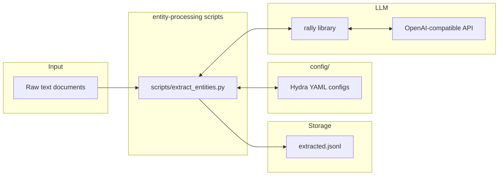

## entity-processing constitution spec

### 1. Executive summary

#### 1.1 Project description 

entity-processing is a research-oriented Python toolkit for extracting structured information from text documents (messages, news articles). The toolkit provides three core capabilities: (1) entity extraction (NER-like identification of persons, organizations, locations, concepts, etc.), (2) sentiment analysis per entity (determining the author's sentiment toward each extracted entity) and (3) relation extraction (identification of relations between entities within one document). The project follows a hydra-backed repository structure with configurable executable scripts for each processing pipeline.

Knowledge graph construction is out of scope for this spec revision entirely (it was considered and deferred; subject to revision in future).

#### 1.2 Project motivation

The project addresses the need for systematic, research-grade text analysis that goes beyond simple keyword matching or flat NER. By combining entity extraction with sentiment attribution and relation extraction, it enables holistic understanding of large document corpora — supporting research questions about how entities are discussed, connected, and characterized across messages and news sources.

#### 1.3 Implementation repos

`entity-processing`

#### 1.4 Execution mode

Manual

### 2. Requirement analysis

#### 2.1 Functional requirements

**FR1. Entity Extraction**: Given a raw text document, identify and classify entities (persons, organizations, locations, dates, concepts, etc.) with their mentions and types.

**FR2. Sentiment Analysis per Entity**: For each extracted entity, determine the author's sentiment (positive, negative, neutral) toward that specific entity within the context of the document.

**FR3. Relation Extraction**: For extracted entities, identify relations between entities and classify these relations (located at, work at, etc.).

#### 2.2 Non-functional requirements

**NFR1. Time Performance**: 100 documents must be processed within 10 minutes.

**NFR2. LLM**: The default LLM is `glm-5.3-flash`. Model overrides via Hydra configuration are allowed (e.g. for research experiments), but validation is performed with `glm-5.3-flash` only.

#### 2.3 Preferences

**P1. Configurability**: All parameters (model, endpoint, prompt templates, entity types) must be configurable via Hydra YAML configs — no hardcoded values.

**P2. Modularity**: If possible, each processing step (e.g., NER, sentiment, relations) should be independently usable and composable.

**P3. LLM Backend**: All NLP capabilities use the `rally` library for LLM interaction, with the API endpoint and model name configurable via Hydra.

**P4. Type Safety**: All code must use Python type hints, enforced by linters.

**P5. Extensibility**: New entity types and relation types should be addable without modifying core code.

**P6. Multi-language Support**: All extraction and analysis capabilities should work across multiple languages, not limited to English.

### 3. Acceptance criteria

Any implementation is validated by the independently managed validation service in the validation subproject. The solution developer only sends an HTTP request to the service endpoint; they do not launch or configure the validation service.

#### 3.1 Validation endpoint

Send an HTTP `POST` request with `Content-Type: application/json` to:

```text
http://localhost:8456/validate
```

The validation service's suite, datasets, working directory, and runtime settings are managed by the validation subproject and are not request parameters. The request is:

```json
{
  "repo": "<clonable link to entity-processing repository>",
  "commit": "<commit hash>",
  "solution_overrides": "<args separated by whitespaces>"
}
```

`repo` and `commit` are required strings. `solution_overrides` is optional and defaults to the empty string. For example:

```bash
curl -X POST http://localhost:8456/validate \
  -H 'Content-Type: application/json' \
  -d '{
    "repo": "<clonable link to entity-processing repository>",
    "commit": "<commit hash>",
    "solution_overrides": ""
  }'
```

For a valid request, the validation service clones the specified repository, checks out the specified commit, prepares its configured validation datasets, and runs `scripts/extract_entities.py` once per configured dataset entry.

#### 3.2 Solution invocation

The validation service invokes `scripts/extract_entities.py` with these Hydra-style arguments:

- `input=<path to a JSONL file with documents>`
- `output=<path to the JSONL output file>`
- `entity_types=[LOCATION, ORGANIZATION, PEOPLE, OTHER]`
- `relation_types=[WORK_FOR, KILL, ORGANIZATION_BASED_IN, LIVE_IN, LOCATED_IN]`
- `sentiment_types=[POSITIVE, NEUTRAL, NEGATIVE]`

Arguments in `solution_overrides`, when present, are appended to these arguments.

The solution must not depend on files in the validation service's working directory other than the files provided through the invocation arguments.

The `input` file is JSONL. Each line is one document:

```json
{"doc_id": "<document identifier>", "text": "<document text>"}
```

The solution must write one JSON object per input document to the path specified by `output`. Each output `doc_id` must identify the corresponding input document.

#### 3.3 Solution output contract

Each output JSONL record has this structure:

```json
{
  "doc_id": "<document identifier>",
  "entities": [
    {
      "entity_id": "e1",
      "mention": "<entity mention>",
      "type": "<entity type>",
      "sentiment": "<sentiment>"
    }
  ],
  "relations": [
    {
      "relation_type": "<relation type>",
      "head": "e1",
      "tail": "e2"
    }
  ]
}
```

The allowed entity types are `LOCATION`, `ORGANIZATION`, `PEOPLE`, and `OTHER`. The allowed relation types are `WORK_FOR`, `KILL`, `ORGANIZATION_BASED_IN`, `LIVE_IN`, and `LOCATED_IN`. The allowed sentiment types are `POSITIVE`, `NEUTRAL`, and `NEGATIVE`.

`entity_id` values must be unique within a document. Every relation's `head` and `tail` must refer to an `entity_id` in that same document's `entities` list. Malformed or unparseable output makes the affected metrics impossible to compute.

#### 3.4 Validation response

A successful validation request returns HTTP 200 with one top-level object per acceptance criterion:

```json
{
  "AC1": {
    "status": "accepted",
    "metrics_status": {
      "VM1": {
        "computation_status": "computed",
        "acceptance_status": "accepted",
        "computed_value": 0.85,
        "expected_value_or_threshold": 0.8,
        "error_message": null
      }
    }
  }
}
```

The response contains all acceptance criteria and all metrics belonging to them. `computation_status` is `computed` or `failed_to_compute`; `acceptance_status` is `accepted`, `rejected`, or `null`; `computed_value` is the measured value or `null` when computation failed; `expected_value_or_threshold` is the condition used for that metric; and `error_message` is `null` on successful computation or describes the failure otherwise.

An acceptance criterion has status:

- `accepted` when all of its metrics were computed and satisfy their conditions;
- `valid` when all of its metrics were computed but at least one condition is not satisfied;
- `invalid` when at least one metric could not be computed.

Malformed requests, missing required fields, or fields with invalid types return an HTTP 4xx response and do not run validation. An unexpected validation-service failure returns an HTTP 5xx response.

#### 3.5 Metrics and acceptance criteria

The validation service computes:

- **VM1. Entity precision:** fraction of produced `(mention, type)` pairs matching gold entities by exact mention match and type equality.
- **VM2. Entity recall:** fraction of gold entities matched by produced `(mention, type)` pairs.
- **VM3. Sentiment precision:** fraction of produced sentiment labels matching the gold sentiment of the corresponding entity.
- **VM4. Sentiment recall:** fraction of gold sentiment labels matched by produced sentiment labels.
- **VM5. Relation precision:** fraction of produced relations matching gold relations by relation type and endpoint mentions.
- **VM6. Relation recall:** fraction of gold relations matched by produced relations.
- **VM7. Time per 100 documents:** the maximum solution-run time normalized to 100 documents across the configured validation runs.
- **VM8. LLM model check:** true only when the effective solution configuration resolves to `glm-5.3-flash`.

The acceptance criteria are:

- **AC1. Accurate entity extraction:** VM1 > 0.8 and VM2 > 0.8;
- **AC2. Accurate sentiment analysis:** VM3 > 0.8 and VM4 > 0.8;
- **AC3. Accurate relation extraction:** VM5 > 0.6 and VM6 > 0.6;
- **AC4. Satisfactory time performance:** VM7 < 10 minutes;
- **AC5. Correct LLM model:** VM8 = `true`.

#### 3.6 Illustrative validation-dataset samples

The following examples are representative shapes and content of the validation datasets; they are newly written illustrations, not copied dataset records. The entity-relation dataset contains a document together with typed entity mentions and relations between them:

```json
{
  "doc_id": "example-01",
  "text": "Dr. Elena Marquez joined Northstar Labs in Madrid and now lives there.",
  "entities": [
    {"mention": "Elena Marquez", "type": "PEOPLE"},
    {"mention": "Northstar Labs", "type": "ORGANIZATION"},
    {"mention": "Madrid", "type": "LOCATION"}
  ],
  "relations": [
    {"relation_type": "WORK_FOR", "head": "Elena Marquez", "tail": "Northstar Labs"},
    {"relation_type": "LIVE_IN", "head": "Elena Marquez", "tail": "Madrid"}
  ]
}
```

The sentiment dataset contains a document and entity-level sentiment labels, where the label describes the author's sentiment toward the entity in that document:

```json
{
  "doc_id": "example-02",
  "text": "Мэр похвалил компанию «Волна Энерджи» за быстрое восстановление электроснабжения, хотя жители критиковали её за прежние задержки.",
  "entities": [
    {"mention": "Волна Энерджи", "type": "ORGANIZATION", "sentiment": "POSITIVE"},
    {"mention": "жители", "type": "OTHER", "sentiment": "NEUTRAL"}
  ]
}
```

These examples describe gold-data concepts used to compute the metrics; the solution receives only the document fields specified in §3.2 and must produce the output structure specified in §3.3.

### 4. Insight

**Idea 1: Traditional NLP pipeline (spaCy, transformers, rule-based).** Use dedicated models for each task: spaCy or a fine-tuned BERT for NER, sentiment classifiers for sentiment analysis, rule-based or pattern-matching extractors for facts, and a separate graph construction module. This approach offers full control over each component and can be highly optimized for speed and cost.

**Idea 2: LLM-based pipeline (chosen).** Use a single LLM (via the `rally` library) to perform all extraction tasks — entity recognition, sentiment attribution, fact extraction, and relation identification — through carefully designed prompts. The LLM handles multi-language natively and requires no task-specific model training.

**Rationale for choosing Idea 2:**
- **Research focus**: The project's primary goal is answering research questions, not achieving production-scale throughput. LLM-based extraction provides high-quality results with minimal engineering overhead.
- **Multi-language**: A capable LLM handles English and Russian (and other languages) out of the box, whereas traditional approaches require separate models per language.
- **Flexibility**: Prompts can be iterated quickly as research questions evolve, without retraining models or adjusting feature pipelines.
- **Unified interface**: Using `rally` as the LLM abstraction layer keeps the codebase clean and makes swapping models or endpoints trivial.
- **Simplicity**: Fewer dependencies, no model training infrastructure, and easier to onboard collaborators.

**Note 1:** we may gradually turn to Idea 1 if we want to optimize the computational cost in future. We should keep this in mind while developing the repo.

**Note 2:** the sentiment analysis task we need to solve is called *targeted sentiment analysis* in the literature. A classical citation would be [Jiang et al. Target-dependent Twitter sentiment classification (2011)](https://aclanthology.org/P11-1016.pdf). Another branch of sentiment analysis which might be useful in future is *aspect-based sentiment analysis (ABSA)* where we are interested in polarities towards various aspects of the entity rather than the overall sentiment about the entity. These two branches are combined in targeted aspect-based sentiment analysis, see [Saeidi et al. SentiHood: targeted aspect based sentiment analysis dataset for urban neighbourhoods](https://arxiv.org/pdf/1610.03771). 

### 5. Overall solution design

#### 5.1 High-level design



**Note:** the output JSONL file includes sentiments and relations associated with entities.

#### 5.2 Core components

1. **`scripts/extract_entities.py`** — Executable script for entity extraction, configured via Hydra. Given that we implement NER by calling an LLM, we should extract local (to a document) relations and perform sentiment analysis within the same API call.
2. **`config/`** — Hydra configuration files defining prompts, LLM settings (`rally` backend config), and entity types.
